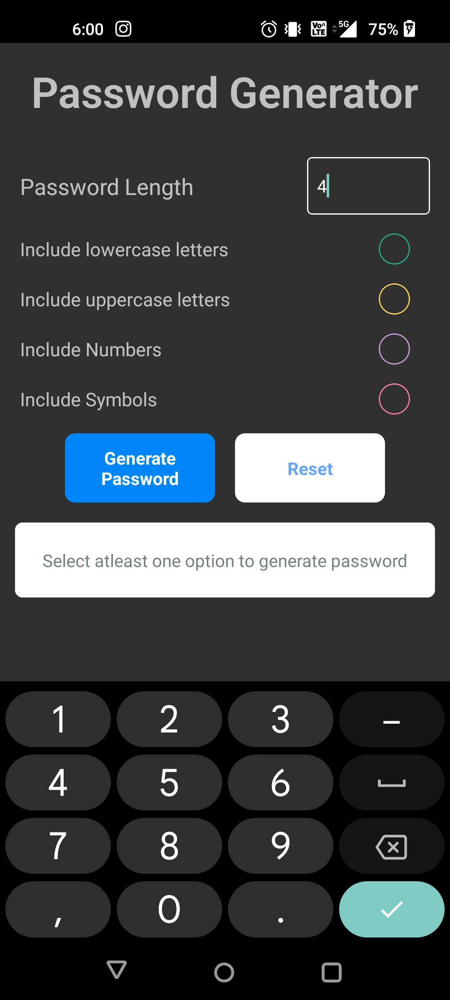
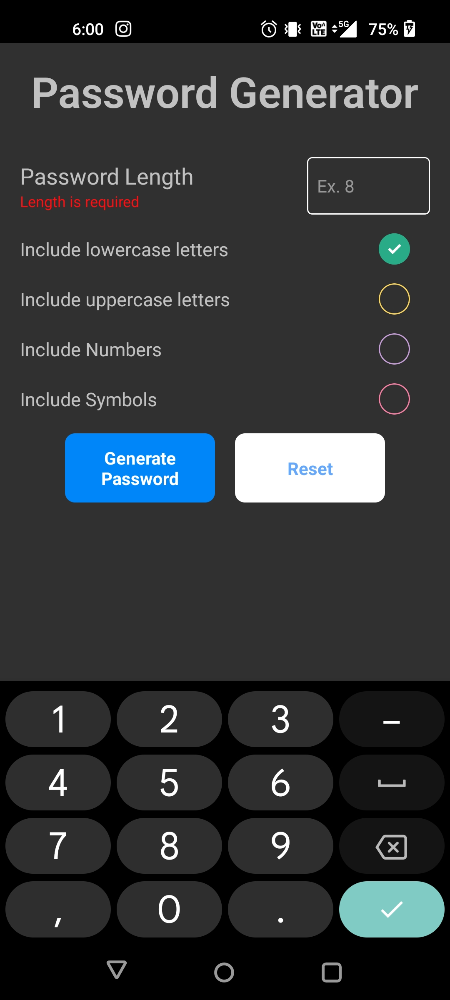
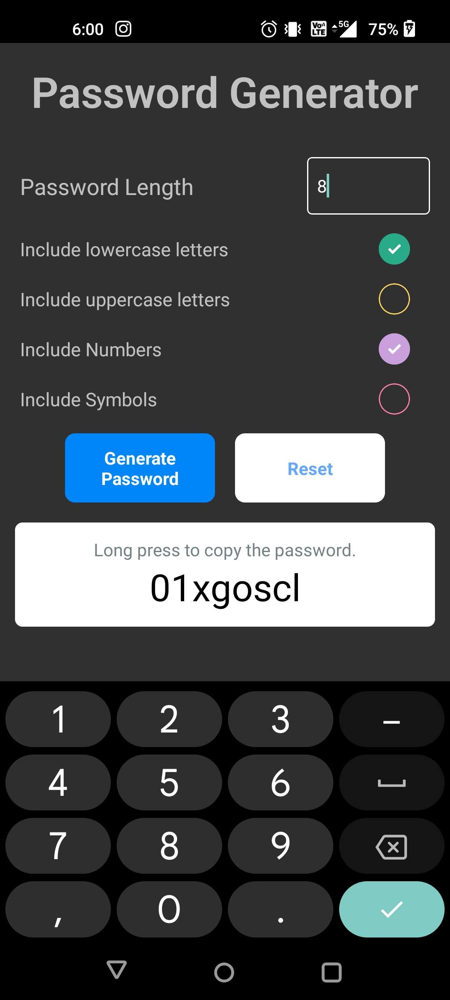

# Random Password Generator

## Overview

This is a random password generator app built with JavaScript, React, Formik, and Yup. It allows users to generate random passwords based on their preferences such as using lowercase letters, uppercase letters, numbers, and symbols. The user can also specify the length of the password within a range of 4 to 16 characters.

## Demo




## Features

- Generate random passwords based on user preferences.
- Options to include lowercase letters, uppercase letters, numbers, and symbols in the password.
- Specify the length of the password within a range of 4 to 16 characters.
- Input form validation using Yup for ensuring valid input data.
- Error handling and display using Formik.
- Copy generated password to clipboard by long pressing on it.

## Installation

1. Clone the repository:

    ```bash
    git clone https://github.com/sargunkohli152/PasswordGenerator-MobileApp.git
    ```
2. Navigate to the project directory:
    ```bash
    cd PasswordGenerator-MobileApp
    ```
3. Install dependencies:
    ```bash
    npm install
    ```

## Usage
1. Start the development server
    ```bash
    npx react-native run-android
    ```
2. Specify your password preferences using the input form.
3. Click on the "Generate Password" button to generate a random password.
4. Long press on the generated password to copy it to the clipboard.

## Contributing
Contributions are welcome! If you find any bugs or have suggestions for improvement, please feel free to open an issue or submit a pull request.

## License
This project is licensed under the MIT License
